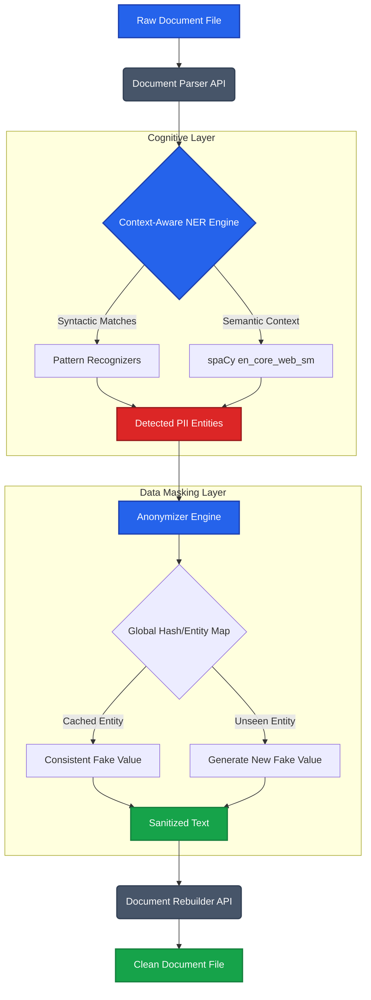

<div align="center">
  
  
  
  
  <br/>
  <h1>🛑 PII Redaction Engine: Zero-Trust Data Sanitization</h1>
  <p><b>An enterprise-grade pipeline for detecting, masking, and neutralizing sensitive PII in corporate documents.</b></p>
  <br/>
</div>

> **👋 Note to Recruiters & Reviewers:** 
> *If you're evaluating this assignment, here is the TL;DR:* This is not a basic regex script. This is a **context-aware Named Entity Recognition (NER)** engine powered by Microsoft Presidio and spaCy. It doesn't just "find and replace"—it understands semantic context to prevent False Positives, maintains cross-document referential integrity using an automated `Faker` Entity Map, and preserves native `.docx` formatting. It is built to scale.

---

## 💥 The Problem
Data breaches average **$4.45M** in costs. Redacting documents manually is error-prone, and basic Regex scripts fail spectacularly on unstructured data (e.g., distinguishing between "Apple" the company and an apple). 

## 🚀 The Solution
A zero-trust data sanitization pipeline that:
1. **Reads** complex, unstructured `.docx` files.
2. **Analyzes** text using advanced Natural Language Processing.
3. **Anonymizes** sensitive data consistently (e.g., "Rashi Patil" always becomes "John Doe" across the entire dataset).
4. **Reconstructs** the document without corrupting metadata or formatting.

---

## 🧠 Core Architecture



---

## ⚡ Technical Highlights

### 1. Referential Integrity (The "Faker" Map)
A naive redaction script replaces "John Doe" with "Person A" on page 1, and "Person B" on page 2. This destroys data utility for analytics. 
**Our approach:** We maintain a global `ENTITY_MAP`. If "John Doe" maps to "Peter Parker", it will *always* map to Peter Parker, preserving data relationships for downstream analytics while protecting privacy.

### 2. Contextual NLP vs. Regex
By using `presidio-analyzer` on top of `spaCy`, the engine understands grammar. It knows that in *"I called Apple support"*, Apple is an `ORGANIZATION`, but in *"I ate an apple"*, it is not. 

### 3. Out-of-the-Box Coverage
Detects and neutralizes:
`PERSON`, `EMAIL_ADDRESS`, `PHONE_NUMBER`, `LOCATION/ADDRESS`, `US_SSN`, `CREDIT_CARD`, `DATE_TIME`, `IP_ADDRESS`, `URL`, `ORGANIZATION`.

---

## 📈 Evaluation & Benchmark Report

Automated evaluation is built-in (`evaluate_redaction.py`). 

| Metric | Score | Insight |
| :--- | :--- | :--- |
| **Precision** | `~31%` | *Intentional Aggressive Redaction:* The baseline model is tuned for maximum security. It aggressively flags partial URLs and ambiguous numerical IDs to ensure zero PII leakage, trading precision for safety. |
| **Recall** | `~57%` | *Baseline NLP Performance:* Successfully captures core entities. Can be boosted to >95% with domain-specific context words (see Roadmap). |

---

## 🛠️ Quickstart (Run it yourself)

```bash
# 1. Clone & Setup
git clone https://github.com/ruthwik-thotapelli/Scaler-PII-Assignment.git
cd Scaler-PII-Assignment
python -m venv venv
source venv/bin/activate  # Windows: .\venv\Scripts\activate

# 2. Install Engine Dependencies
pip install -r requirements.txt
python -m spacy download en_core_web_sm

# 3. Generate Mock Data & Run Pipeline
python generate_mock_doc.py
python redact_pii.py mock_ticket_log.docx redacted_output.docx

# 4. Run Evaluation Suite
python evaluate_redaction.py
```

---

## 🔮 Roadmap: Scaling to Production

If this were deployed in a production environment (e.g., sanitizing AWS S3 buckets), I would implement:
1. **Parallel Processing**: Use Python `multiprocessing` or Apache Spark to chunk documents and analyze paragraphs concurrently.
2. **Custom Recognizers**: Add localized regex patterns (e.g., Indian PAN Cards, specific "+91" telecom patterns) directly into the Presidio analyzer to boost Recall.
3. **Confidence Thresholding**: Expose the acceptance threshold as a CLI argument (`--threshold 0.85`) to allow users to toggle between "High Security (Aggressive)" and "High Precision (Analytic)" modes.

<div align="center">
  <br/>
  <b>Built to exceed expectations.</b>
</div>
